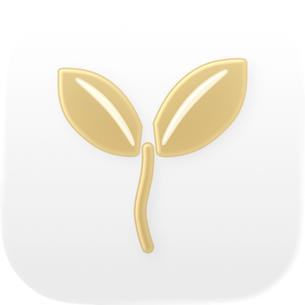
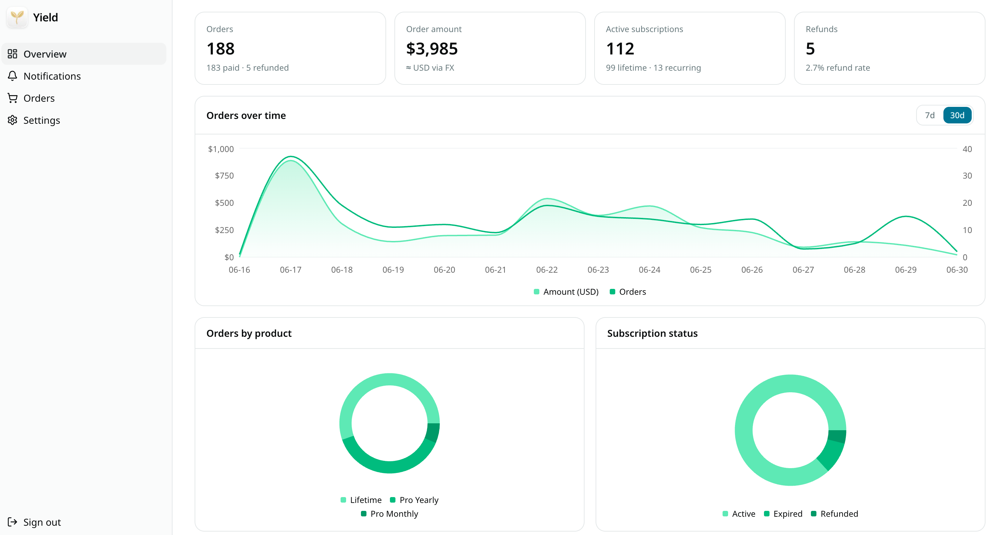

<div align="center">



# Yield

**English** · [简体中文](README.zh-CN.md)

[](LICENSE)
[](https://deploy.workers.cloudflare.com/?url=https://github.com/chen2he/Yield)

</div>

> One-click deploy provisions the Worker and D1. Afterwards, [apply migrations](#setup) and set the secrets (`ADMIN_PASSWORD`, `VAPID_PRIVATE_KEY`) — see [Setup](#setup).

Yield is a self-hosted **App Store Connect (ASC) order-management console**, fed **entirely by App Store Server Notifications V2** — no API polling. It verifies, stores, and visualizes your in-app purchase and subscription events, then fans them out as push notifications.

Built on Next.js 16 + Cloudflare Workers (via OpenNext) + D1.

<p align="center">
  
</p>

## Features

- **Overview** — KPI cards + charts (orders, revenue via FX, active subscriptions, refund rate), with environment (All / Production / Sandbox) and 7-day / 30-day range switchers.
- **Orders** — filter by type, storefront, transaction status, subscription status, and environment; sort by amount and date; pagination with page-size control; detail drawer.
- **Notifications** — filter by event type, subtype, and environment; sortable; detail drawer.
- **Bidirectional drill-down** — jump between an order and its related notifications.
- **Settings** — display currency, product-ID → label mapping, push device IDs (Bark / Orange Cloud), push language, and a browser-notification toggle.
- **Webhook ingestion** — ASSN V2 with full JWS signature verification (x5c chain pinned to Apple Root CA G3) and idempotent storage.
- **Push** — Bark + Orange Cloud (Bark V2 protocol) + **Web Push** (VAPID, pure WebCrypto). Content is localized; the Bark group is the app's App Store display name (resolved from `appAppleId` via the iTunes Lookup API).
- **PWA** — installable, with a service worker and app icons.
- **i18n & theming** — English + 简体中文 (next-intl); light / dark / system themes.

## Tech stack

Next.js 16 (App Router, Turbopack) · React 19 · `@opennextjs/cloudflare` → Cloudflare Workers · Cloudflare D1 · next-intl · Tailwind CSS v4 · shadcn/ui · next-themes · Recharts · `jose` + `@peculiar/x509` (JWS verification).

## How it works

```
App Store Connect ──(ASSN V2, signed JWS)──▶ POST /api/asc/webhook
                                                 │  verify (jose + x5c chain → Apple Root CA G3)
                                                 ▼
                                            Cloudflare D1
                                   (notifications · transactions · subscriptions)
                                                 │
                                                 ▼
                              Bark · Orange Cloud · Web Push   (localized, new events only)
```

The webhook endpoint is intentionally **public** — Apple must reach it. Its only security boundary is JWS signature verification; there is no shared secret. The admin console is gated by a single secret (`ADMIN_PASSWORD`, an HMAC-signed session cookie).

## Prerequisites

- Node.js 20+ and pnpm
- A Cloudflare account and Wrangler (`npx wrangler …`)

## Setup

1. **Install**

   ```bash
   pnpm install
   ```

2. **Create a D1 database** and wire it into the `DB` binding in `wrangler.jsonc` (set `database_name` / `database_id`).

   ```bash
   npx wrangler d1 create yield
   ```

   > Forking? `wrangler.jsonc` also holds instance-specific values to change: the worker `name` (and the matching `WORKER_SELF_REFERENCE` service), and the `routes` custom domain (set to the author's `yield.o-c.do` — remove it or point it at your own).

3. **Apply migrations** (local and remote). The scripts target the `DB` binding rather than a hardcoded database name, so they work unchanged no matter what you named your D1 database in step 2:

   ```bash
   pnpm run db:migrate:local
   pnpm run db:migrate:remote
   ```

4. **Generate a VAPID key pair** (for Web Push):

   ```bash
   node -e 'const{webcrypto:w}=require("crypto");w.subtle.generateKey({name:"ECDSA",namedCurve:"P-256"},true,["sign","verify"]).then(async k=>{const p=Buffer.from(await w.subtle.exportKey("raw",k.publicKey)).toString("base64url");const j=await w.subtle.exportKey("jwk",k.privateKey);console.log("VAPID_PUBLIC_KEY="+p);console.log("VAPID_PRIVATE_KEY="+j.d)})'
   ```

5. **Configure environment**

   - Local: `cp .dev.vars.example .dev.vars`, then fill in `ADMIN_PASSWORD` and the VAPID values.
   - Production:
     - `npx wrangler secret put ADMIN_PASSWORD`
     - `npx wrangler secret put VAPID_PRIVATE_KEY`
     - put `VAPID_PUBLIC_KEY` and `VAPID_SUBJECT` in `wrangler.jsonc` → `vars`.

6. **Run locally**

   ```bash
   pnpm dev
   ```

7. **Deploy** — this also applies any pending remote migrations first:

   ```bash
   pnpm run deploy
   ```

8. **Point App Store Connect** — set the **App Store Server Notifications V2** URL (Production and/or Sandbox) to:

   ```
   https://<your-worker-domain>/api/asc/webhook
   ```

## Environment variables

| Name | Kind | Description |
| --- | --- | --- |
| `ADMIN_PASSWORD` | secret | Admin login secret / session signing key |
| `VAPID_PUBLIC_KEY` | var | Web Push public key (base64url) |
| `VAPID_PRIVATE_KEY` | secret | Web Push private key |
| `VAPID_SUBJECT` | var | VAPID contact (`mailto:` or `https:`) |
| `NEXTJS_ENV` | var | `development` for local dev |

The D1 binding `DB` is declared in `wrangler.jsonc`.

## Push notifications

- **Bark / Orange Cloud** — set the device IDs in Settings; both speak the Bark V2 protocol. Revenue events get a time-sensitive alert + sound; sandbox events are delivered silently. The notification group is the app's App Store display name.
- **Web Push** — open Settings → Browser notifications → Enable (requires HTTPS, or `localhost`). Subscriptions live in D1; payloads are encrypted with WebCrypto (RFC 8291 / RFC 8292).
- Push content language is chosen separately in Settings, since the webhook has no UI locale.

## Project structure

```
migrations/             D1 schema (notifications, transactions, subscriptions, settings, products, push_subscriptions)
public/                 manifest, service worker, app icons
src/app/[locale]/       localized routes; the /admin console lives under (panel)
src/app/api/            asc/webhook, push/subscribe, push/unsubscribe
src/lib/asc/            verify · store · queries · notify · web-push · fx · labels · storefronts · settings
src/components/         UI primitives + admin components
src/i18n/ · src/messages/   next-intl config + en / zh-Hans translations
```

## License

[Apache License 2.0, with an additional attribution requirement](LICENSE) © chen2he

Deployments and forks must keep a visible credit to Yield and its author — see the LICENSE file for the exact terms.
