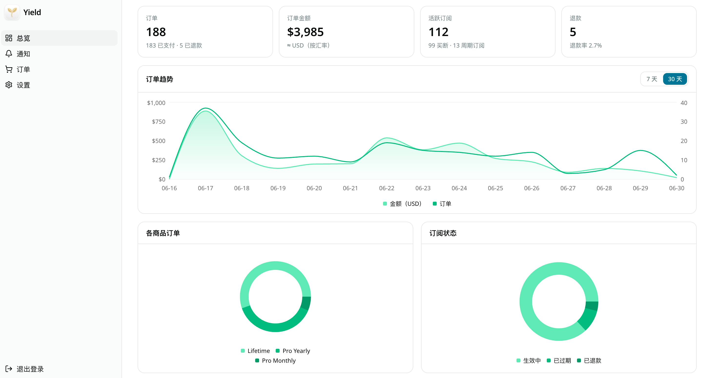

<div align="center">


# Yield

[English](README.md) · **简体中文**

[](LICENSE)
[](https://deploy.workers.cloudflare.com/?url=https://github.com/chen2he/Yield)

</div>

> 一键部署会自动创建 Worker 与 D1。部署后还需[执行迁移](#部署步骤)并设置密钥（`ADMIN_PASSWORD`、`VAPID_PRIVATE_KEY`）——详见[部署步骤](#部署步骤)。

Yield 是一个可自托管的 **App Store Connect（ASC）订单管理控制台**，数据**完全来自 App Store Server Notifications V2**——不做 API 轮询。它对内购与订阅事件验签、入库、可视化，并以推送的形式分发出去。

技术底座：Next.js 16 + Cloudflare Workers（经 OpenNext）+ D1。

<p align="center">
  
</p>

## 功能

- **总览** — KPI 卡片 + 图表（订单数、按汇率折算的金额、活跃订阅、退款率），带环境（全部 / Production / Sandbox）与 7 天 / 30 天切换。
- **订单** — 按类型、地区（storefront）、交易状态、订阅状态、环境筛选；按金额与时间排序；分页 + 每页数量切换；详情抽屉。
- **通知** — 按事件类型、子类型、环境筛选；可排序；详情抽屉。
- **双向下钻** — 订单与其关联通知之间互相跳转。
- **设置** — 展示币种、商品 ID → 名称映射、推送 device ID（Bark / Orange Cloud）、推送语言，以及浏览器通知开关。
- **Webhook 接入** — 接收 ASSN V2，完整 JWS 验签（x5c 证书链固定到 Apple Root CA G3），幂等入库。
- **推送** — Bark + Orange Cloud（Bark V2 协议）+ **Web Push**（VAPID，纯 WebCrypto）。内容本地化；Bark 分组名取该 app 的 App Store 名称（用 `appAppleId` 经 iTunes Lookup API 查询）。
- **PWA** — 可安装，含 service worker 与应用图标。
- **国际化与主题** — 英文 + 简体中文（next-intl）；浅色 / 深色 / 跟随系统。

## 技术栈

Next.js 16（App Router、Turbopack）· React 19 · `@opennextjs/cloudflare` → Cloudflare Workers · Cloudflare D1 · next-intl · Tailwind CSS v4 · shadcn/ui · next-themes · Recharts · `jose` + `@peculiar/x509`（JWS 验签）。

## 工作原理

```
App Store Connect ──(ASSN V2，已签名 JWS)──▶ POST /api/asc/webhook
                                                 │  验签（jose + x5c 链 → Apple Root CA G3）
                                                 ▼
                                            Cloudflare D1
                                   (notifications · transactions · subscriptions)
                                                 │
                                                 ▼
                              Bark · Orange Cloud · Web Push   （本地化，仅新事件）
```

Webhook 端点是**有意公开**的——Apple 必须能访问它。它唯一的安全边界是 JWS 验签，没有共享密钥。管理后台由单一口令（`ADMIN_PASSWORD`，HMAC 签名的会话 cookie）保护。

## 前置要求

- Node.js 20+ 与 pnpm
- 一个 Cloudflare 账号与 Wrangler（`npx wrangler …`）

## 部署步骤

1. **安装依赖**

   ```bash
   pnpm install
   ```

2. **创建 D1 数据库**，并填入 `wrangler.jsonc` 中的 `DB` 绑定（设置 `database_name` / `database_id`）。

   ```bash
   npx wrangler d1 create yield
   ```

   > Fork 自用？`wrangler.jsonc` 里还有几处实例相关值需要改：worker `name`（及对应的 `WORKER_SELF_REFERENCE` 服务名），以及 `routes` 自定义域名（当前是作者的 `yield.o-c.do`，请删除或改成你自己的）。

3. **执行迁移**（本地与远程）。脚本按 `DB` 绑定而非硬编码的数据库名操作，所以无论第 2 步里你的 D1 数据库叫什么名字都无需改动：

   ```bash
   pnpm run db:migrate:local
   pnpm run db:migrate:remote
   ```

4. **生成 VAPID 密钥对**（用于 Web Push）：

   ```bash
   node -e 'const{webcrypto:w}=require("crypto");w.subtle.generateKey({name:"ECDSA",namedCurve:"P-256"},true,["sign","verify"]).then(async k=>{const p=Buffer.from(await w.subtle.exportKey("raw",k.publicKey)).toString("base64url");const j=await w.subtle.exportKey("jwk",k.privateKey);console.log("VAPID_PUBLIC_KEY="+p);console.log("VAPID_PRIVATE_KEY="+j.d)})'
   ```

5. **配置环境变量**

   - 本地：`cp .dev.vars.example .dev.vars`，填入 `ADMIN_PASSWORD` 与 VAPID 值。
   - 生产：
     - `npx wrangler secret put ADMIN_PASSWORD`
     - `npx wrangler secret put VAPID_PRIVATE_KEY`
     - 把 `VAPID_PUBLIC_KEY` 与 `VAPID_SUBJECT` 写入 `wrangler.jsonc` 的 `vars`。

6. **本地运行**

   ```bash
   pnpm dev
   ```

7. **部署**（会先自动执行待应用的远程迁移）：

   ```bash
   pnpm run deploy
   ```

8. **配置 App Store Connect** — 把 **App Store Server Notifications V2** 的通知 URL（Production 和 / 或 Sandbox）设为：

   ```
   https://<你的-worker-域名>/api/asc/webhook
   ```

## 环境变量

| 名称 | 类型 | 说明 |
| --- | --- | --- |
| `ADMIN_PASSWORD` | secret | 后台登录口令 / 会话签名密钥 |
| `VAPID_PUBLIC_KEY` | var | Web Push 公钥（base64url） |
| `VAPID_PRIVATE_KEY` | secret | Web Push 私钥 |
| `VAPID_SUBJECT` | var | VAPID 联系方式（`mailto:` 或 `https:`） |
| `NEXTJS_ENV` | var | 本地开发设为 `development` |

D1 绑定 `DB` 在 `wrangler.jsonc` 中声明。

## 推送通知

- **Bark / Orange Cloud** — 在设置里填写 device ID；二者都走 Bark V2 协议。入账事件带时效性提醒 + 响声；沙盒事件静默送达。分组名为该 app 的 App Store 名称。
- **Web Push** — 在 设置 → 浏览器通知 → 开启（需 HTTPS，或 `localhost`）。订阅存于 D1；载荷用 WebCrypto 加密（RFC 8291 / RFC 8292）。
- 推送内容语言在设置中单独选择，因为 webhook 触发时没有界面语言上下文。

## 项目结构

```
migrations/             D1 表结构（notifications、transactions、subscriptions、settings、products、push_subscriptions）
public/                 manifest、service worker、应用图标
src/app/[locale]/       本地化路由；/admin 控制台位于 (panel) 下
src/app/api/            asc/webhook、push/subscribe、push/unsubscribe
src/lib/asc/            verify · store · queries · notify · web-push · fx · labels · storefronts · settings
src/components/         UI 基础组件 + 后台组件
src/i18n/ · src/messages/   next-intl 配置 + en / zh-Hans 译文
```

## 许可证

[Apache License 2.0（附加署名条款）](LICENSE) © chen2he

部署或二次开发时必须保留对 Yield 及其作者的可见署名——具体条款见 LICENSE 文件。
